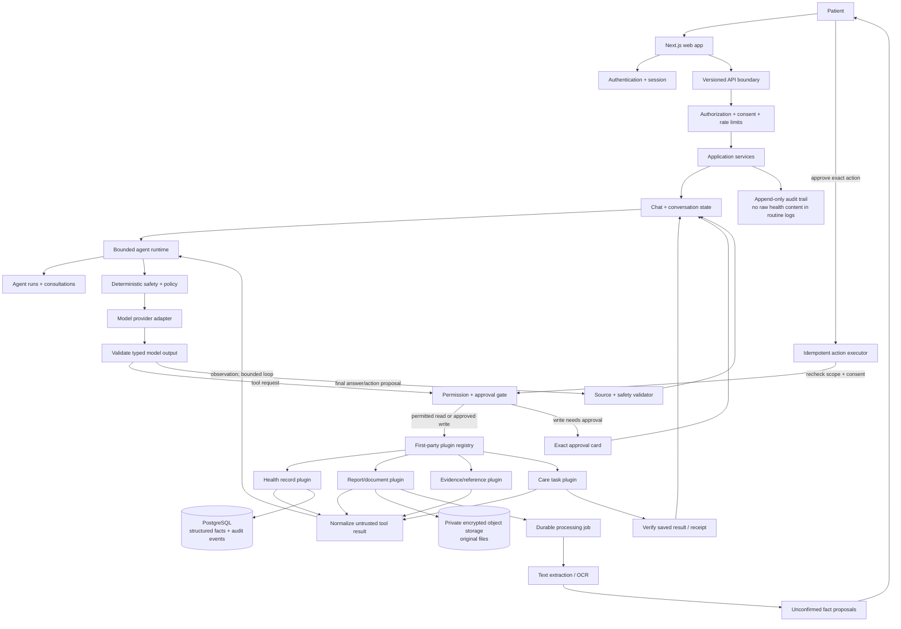

# NutritiScan web product system design

Status: proposed design for review. No new product architecture in this document is implemented by writing this file.

Updated: 5 October 2026

## 1. Product decision

**NutritiScan is a chat-first, agentic health workspace: a Claude Code-like interface for health questions, evidence, records, and carefully approved actions.** Chat is the control room: the user asks, clarifies, sees the agent's concise plan and plugin/tool activity, reviews approvals, and gets verified results in one conversation. The same bounded runtime can support three distinct workspaces: Personal Health (people organizing their own health), Clinical (care professionals working within an authorized care context), and Research (researchers analyzing public or explicitly authorized data). Each workspace has separate identity, tools, data scope, retention, and evaluations. A role switch must never silently widen access to another person's records.

It is not an autonomous doctor or an unsupervised research authority. It must not independently diagnose, prescribe, change treatment, make clinical decisions, or present a literature summary as clinical consensus. The long-term product serves different health roles, but the first build should use synthetic patient records and public research sources; clinician access to real patient data comes only after identity, authorization, governance, and validation are in place. Before any real-data pilot, validate the first job with users and decide the launch geography, data-processing arrangement, and model provider policy.

### Agent behavior

Every agent task follows this loop:

**Understand → check safety and scope → plan → read permitted tools → draft → validate → request approval when needed → execute → verify → explain or hand off.**

The agent may autonomously read and organize information the person authorized it to use, retrieve approved educational sources, ask clarifying questions, and prepare drafts. It must get explicit approval before saving a new health fact, creating a persistent reminder or care task, exporting/sharing information, or contacting another person. Clinical decisions stay with the person and their qualified care team.

### Recommended first build: a public-evidence research assistant inside chat

Start with a researcher workflow over public sources: ask a question, retrieve relevant PubMed articles and ClinicalTrials.gov studies, compare evidence, and create a cited brief with clear limits and gaps. In parallel, use a fixed synthetic patient profile to test health-history tools without real patient data. This lets us build and evaluate the shared agent foundation before account integrations or sensitive clinical data. Personal appointment preparation and report explanation then become skills in the same chat; they are examples, not the product boundary. Clinician workflows follow only when a real partner and governance path exist.

### First complete user journey

1. A user opens the appropriate Personal Health, Clinical, or Research workspace and asks a question. The active workspace is explicit in the conversation.
2. The agent checks for urgent signals, states its scope, and explains a short plan when tools are needed. For an urgent signal it stops ordinary planning and provides configured escalation guidance.
3. It invokes only workspace-enabled plugins/tools, reads only sources that the user is authorized to access, and asks about missing information rather than inferring it.
4. It replies in the conversation with source cards and a clear split between record facts, the person's current report, and general information.
5. If the task needs a write, the chat shows the exact proposed action. The person edits, confirms, or rejects it in context.
6. After approval, the server executes once, verifies the saved result/receipt, and reports success or failure back in the same conversation. External sharing has a separate recipient and consent check.

Document intake, lab explanation, symptom organization and follow-up tasks are agent skills using the same trust boundaries. The first release should prove one complete task before broadening the skill set.

**First release success measure:** the share of supported agent journeys that end in a user-verified outcome (a source-grounded research brief, synthetic-history answer, or confirmed task), with no unsupported fact or duplicate action. Track citation correctness, source coverage, evidence omissions, user corrections, unanswered requests, approval/rejection rates, tool failures, and safe escalations. These are product measures, not evidence of improved health or research outcomes.

## 2. What exists and what does not

### Exists in the active web app

- `/` is the product landing page; `/chat` is an educational supervisor/specialist chat.
- `/api/chat` has request limits, deterministic safety triage, specialist routing, and answer validation for supported clinical turns.
- The existing chat already has agent/tool activity traces and several bounded capabilities. Reuse its tested routing and safety logic; the target adds a general run lifecycle and explicit plugin contract rather than replacing the chat with another product surface.
- Chat threads, profile, and meal notes are browser-local. The submitted message and relevant context go to the configured model provider when hosted inference is enabled.
- `/discharge-demo` is a fictional, browser-local workflow demonstration. It is not a patient-record service.

### Does not exist in the active web app

- A signed-in patient account and server-authoritative medical history.
- A production health-document upload, extraction-review and confirmed-history journey.
- Durable consent records, account export/deletion, or a secure sharing workflow for this active app.
- A clinical validation study, live provider/ABDM/EHR connection, clinician network, or automated follow-up service.

Some older documents describe a removed account workspace or a hospital-first target. This document is the proposed product design; `docs/WEB_PRODUCT_REVIEW.md` records the current implementation gaps. Historical designs are not proof that a feature is live.

## 3. System boundaries

Use a **modular monolith** for the first release. Keep the Next.js chat, API, agent runtime, plugin registry, and domain services in one deployable application, organized into explicit modules. Add a background worker for durable document/follow-up jobs when needed. Adopt the useful agentic-chat pattern—visible tool activity, contextual references, approvals and resumable tasks—without copying coding-agent powers such as arbitrary file/shell execution. Do not begin with microservices, arbitrary third-party code execution, an agent framework migration, or a separate vector database.

### Logical modules

| Module | Responsibility | Must not do |
| --- | --- | --- |
| Chat experience | Main conversation, tool trace, source cards, approval cards, run status; secondary panels for history/settings | Hide tool use, approval needs, or partial failures in prose |
| Identity and access | Sign-in, account recovery, session, access decisions | Trust a patient or role ID supplied in request JSON |
| Record service | Store confirmed facts, provenance, corrections, timeline | Accept model output as a confirmed fact |
| Document service | Private upload, malware/type/size checks, extraction job, review queue | Expose original files publicly or auto-commit OCR output |
| Agent runtime | Understand request, build a bounded plan, call enabled plugins, draft typed output, resume/stop runs | Diagnose, prescribe, invent tool permissions, or treat its plan as an approved action |
| Plugin registry | Publish first-party capability manifests, versions, schemas, scopes, data handling and status | Load arbitrary third-party code or grant broad data access by default |
| Tool gateway and action executor | Validate plugin/tool call, authorize each read/write; require approval, idempotency, expiry and verification for writes | Let the model call arbitrary SQL, URLs, or external actions directly |
| Safety service | Triage rules, policy checks, output validation, fixed escalation responses | Depend only on prompts or model self-assessment |
| Audit and operations | Record actor/action/resource/result metadata; latency and failure metrics | Put prompt text, report contents, or secrets in standard logs |

### Workspaces and data boundaries

| Workspace | First useful jobs | Data and access boundary |
| --- | --- | --- |
| Personal Health | Explain a selected report, organize history, prepare questions for a care visit | The person's own confirmed records and explicitly connected sources; the person controls writes and sharing |
| Research | Search public literature and trials, compare study designs/results, draft a cited evidence brief | Public sources by default; private datasets require a separately authorized, governed project context |
| Clinical | Summarize authorized records, prepare a chart-grounded draft or literature brief for clinician review | Verified professional and organization context, patient authorization, audit, and human sign-off; unavailable in the first release |

These are product workspaces, not three agents with unrestricted shared memory. The active workspace fixes the permitted tools and data; every run carries that scope. Keep public research questions and patient records in separate contexts unless the user deliberately asks for a permitted synthesis and policy allows it.

### Connector strategy

Build a connector interface, but do not assume every consumer app exposes its data. Cal AI's public FAQ documents Apple Health/Google Fit synchronization for steps; it does not establish a public meal-log API. MyFitnessPal describes its developer API as private and approval-based. Do not scrape either app or rely on undocumented endpoints. Apple HealthKit and Android Health Connect are native, permission-scoped mobile platforms; because this product is web-first, direct support requires a companion mobile bridge or an export/import path. Apple clinical-record access has extra entitlement and participating-provider constraints. Begin with user-selected uploads/FHIR files or clearly specified manual entry, then add connectors only after permission, scopes, revocation, and provenance work end to end.

For Research mode, start with public, stable interfaces such as [PubMed E-utilities](https://pubmed.ncbi.nlm.nih.gov/download/) and the [ClinicalTrials.gov API](https://www.nlm.nih.gov/pubs/techbull/ma24/ma24_clinicaltrials_api.html). Store source IDs, retrieval time, query, and exact cited claims; label abstracts separately from full-text review and avoid implying that search ranking equals evidence quality. For clinical systems, prefer standards-based, authorized FHIR exchange over bespoke scraping.

## 4. Request flows

### 4.1 Import and confirm a document

`browser → authenticated upload API → ownership and consent check → private object store → durable job → text/OCR extraction → structured candidate facts with source coordinates → review UI → explicit person confirmation → record service transaction → audit event`

Extraction is asynchronous: the UI can show `uploaded`, `processing`, `needs_review`, `completed`, or `failed`. Retryable infrastructure errors retry with an idempotency key; bad or unsupported documents become a visible failure. Every extracted fact retains document ID, page or field location, extraction version, and review status. A correction appends a replacement fact and keeps the old value in the audit history.

### 4.2 Run an agent task

`browser sends task + conversation ID → API authenticates owner → deterministic urgent-risk triage → policy fixes allowed scope and tools → planner proposes a typed plan → policy checks every tool call → server executes permitted reads → evidence and record context go to the model → model returns a typed answer/action proposal → server validates sources, scope and policy → UI shows plan, answer and proposed actions → person approves/rejects gated actions → executor rechecks policy and runs idempotently → server verifies persisted state/receipt → UI and audit trail show outcome`

The server owns canonical record context and tool execution. The client cannot grant the model more permissions or supply trusted facts. For clinical turns, the server buffers the draft until validation completes; it does not stream unvalidated medical claims. If the model, retrieval or validator is unavailable, the UI says which capability is unavailable and offers a safe next step. Every run has bounded steps, tools, retries, tokens, and wall-clock time.

### 4.3 Tool/action risk gates

| Risk tier | Example | Default behavior |
| --- | --- | --- |
| Read | Read a selected report or confirmed medication list | Execute after owner and scope checks; show sources used |
| Draft | Prepare an answer, visit brief, or question list | Return a reviewable draft; do not silently save it as a medical fact |
| Personal write | Save a fact, reminder, or care task | Show the exact change and require approval; use an idempotency key and verify the saved result |
| External action | Export to a recipient or send a message | Disabled in the first release; later require recipient, payload, consent and final confirmation, then show the receipt/failure |
| Clinical decision | Diagnose, prescribe, alter medication, or make a care decision | Never delegated to the agent |

### 4.4 Export or share a visit brief

`person opens draft → checks each fact/source → edits language → explicitly exports/downloads or chooses a recipient/channel → server checks session, scope and consent again → records the action → returns delivery/export receipt`

The first release should support a user-controlled download. Sending to a clinic, doctor, messaging service, or hospital is a later integration and needs a distinct approval step and delivery state.

## 5. Data model and trust rules

Start with relational PostgreSQL for identity links, structured records, job state, and audit events. Store originals as private encrypted objects and only keep object references and metadata in PostgreSQL. Add semantic/vector retrieval only when measured retrieval quality requires it; vectors never become the source of truth.

Initial logical entities:

- `accounts` and `patients`: separate login/PII from the opaque patient record ID.
- `documents`: owner, encrypted object key, content hash, MIME type, size, source, status, retention and timestamps.
- `health_facts`: patient, type, verbatim value, normalized value/unit when safe, effective date, source type, certainty, document/page pointer, confirmation and supersession fields.
- `fact_conflicts`: two incompatible source facts and their review state; do not choose a winner silently.
- `consultations` and `messages`: explicit retention choice, scoped memory, model/prompt version and request state.
- `agent_runs`: goal, status, bounded plan, policy/model/prompt version, permitted tools, step count, safe error category, timestamps and outcome.
- `action_proposals`: run ID, typed action and arguments, affected records, risk tier, approval status/actor/time, idempotency key, execution result and verification receipt.
- `brief_drafts`: permitted fact/source references, model output schema, citations, validator result, edits and final approval state.
- `care_tasks`: user-confirmed task/reminder, due time, status, source and provenance; notification configuration is separate and opt-in.
- `consent_grants`: purpose, source, data categories, time range, policy version, expiry and revocation.
- `audit_events`: actor, action, resource, time and outcome; exclude raw health values and conversation body.
- `processing_jobs`: idempotency key, job state, attempt count, retry time and safe error category.

Required invariants:

1. Each health fact carries provenance; a fact without a source is not a confirmed fact.
2. `patient_reported`, `document_extracted`, `device_measured`, and `clinician_verified` remain distinct. `model_inferred` is a proposal, never a source fact.
3. Corrections append a new value and preserve what was previously known.
4. Dates, original units, normalized units, lab-provided ranges and unknown values remain explicit.
5. The account/session determines the patient scope. Every read, write, export, and delete checks ownership server-side.
6. Data sent to a hosted model follows a visible, provider-specific policy. Real health data stays disabled until the processing terms, region and operational controls are reviewed.
7. Export and deletion cover database rows, file objects, search indexes, caches and documented backup-retention behavior.

Do not ship real patient records until authentication, isolation, consent, retention, provider handling, security review and an incident process are designed and tested for the chosen launch region.

## 6. API shape

Use `/api/v1` for new resource APIs. The browser sends a message or an upload; the server derives account and patient IDs from the authenticated session.

| Endpoint | Purpose |
| --- | --- |
| `POST /api/v1/documents` | Upload one allowed document; return a processing ID |
| `GET /api/v1/documents/{id}` | Get processing status and proposed facts for the owner |
| `POST /api/v1/documents/{id}/confirm` | Confirm or correct proposed facts; create provenance-backed record entries |
| `GET /api/v1/patient/timeline` | Paginated, source-linked confirmed history |
| `POST /api/v1/consultations` | Create a conversation with a declared data scope |
| `POST /api/v1/consultations/{id}/messages` | Create a validated answer/draft; streaming only for safe, nonclinical status updates |
| `GET /api/v1/agent-runs/{id}` | Read the owner's agent run, progress, approvals needed and result |
| `POST /api/v1/agent-runs/{id}/actions/{actionId}/approve` | Approve one exact proposed action; server rechecks identity and policy |
| `POST /api/v1/agent-runs/{id}/cancel` | Cancel a queued/running task and prevent stale proposals from executing |
| `GET /api/v1/plugins` | List available first-party plugins, status, and requested data scopes |
| `POST /api/v1/plugins/{id}/permissions` | Grant or revoke the user's selected scopes for a plugin |
| `POST /api/v1/consultations/{id}/visit-brief` | Generate a draft from an explicit date range and selected sources |
| `GET /api/v1/care-tasks` | List confirmed user-owned follow-up tasks and their status |
| `POST /api/v1/visit-briefs/{id}/approve` | Record the person's reviewed final brief |
| `GET /api/v1/patient/export` | Download the person's portable data export |
| `DELETE /api/v1/patient` | Start and verify account/data deletion, with honest backup-retention status |

Every resource ID lookup must include ownership in the database query. A random UUID is not authorization. Validate request bodies with runtime schemas; return stable error codes and safe messages rather than provider exceptions.

## 7. AI and agent design

Start with one user-facing agent and bounded task skills, not a free-roaming autonomous agent. Internal skills may handle records, report explanation, visit preparation, or follow-up. Begin with deterministic skill routing and one model call; separate specialist agents only when evaluation demonstrates a benefit:

1. Deterministic code checks urgent signals and whether the requested task is supported.
2. A router chooses a bounded skill and allowed tool set. Unsupported requests stop with an honest boundary.
3. A planner returns a versioned plan with goal, steps, read scopes, proposed writes, and stop conditions. Policy code may reject or narrow the plan before any tool runs.
4. Server-side tools read only permission-scoped facts and approved references. The model cannot issue arbitrary SQL, fetch arbitrary URLs, or call an unreviewed external tool.
5. The model returns a versioned result: answer, missing information, fact IDs, source IDs, proposed actions, and a confidence category with a reason.
6. Deterministic validators check that IDs are in scope, source claims match stored facts, citations exist, and forbidden advice/actions are absent.
7. The person approves gated actions. The executor rechecks policy, executes once, verifies persisted state/receipt, and ends the run as succeeded, needs approval, needs human, failed, cancelled, or expired.

Use one model call first. Add a second critic or specialist only if evaluations show a specific failure the extra latency/cost improves. Keep the provider behind an adapter so a hosted API can be disabled in favor of a local or approved model without moving domain rules into the prompt. Persist enough run metadata to explain what the agent tried, without retaining raw sensitive content in operational logs.

### Plugin contract

A **tool** is one typed operation, such as `search_health_history` or `draft_visit_brief`. A **plugin** packages related tools with a manifest that the host can inspect and enforce. The model sees the tool name, short description, and input schema; it never receives a plugin's secret credentials or direct implementation access.

Each manifest should declare:

- stable plugin ID, version, owner, description, and enabled/disabled/needs-permission/unavailable status;
- tools with input and output schemas, timeout, retry policy, and whether the operation is read-only or writes state;
- minimum data scopes (for example, selected lab reports, medication list, or care tasks) and whether hosted-model processing is involved;
- risk tier, required approval, idempotency behavior, and stop/undo behavior where possible.

The host owns installation, validation, permission prompts, tool dispatch, and audit. Tool output is untrusted input: a PDF, connected service, or plugin response may contain prompt injection, so normalize it, preserve provenance, and never let its text change agent policy. Start with **first-party plugins implemented in this repository**; do not run user-uploaded or arbitrary third-party plugin code. A later external plugin protocol must run through a server-side sandbox/adapter and the same per-user permission gate.

Initial first-party plugin set:

1. **Public evidence search:** search PubMed and ClinicalTrials.gov; return stable identifiers, metadata, retrieval time, and source links.
2. **Synthetic health history:** read fixed test facts and return fact IDs with provenance; keep this plugin available for development/evaluation without real patient data.
3. **Reports and labs:** later read a person-selected report, explain extracted fields, and flag missing units/ranges without changing the record.
4. **Care tasks:** later propose a reminder or task; create it only after the person approves the exact text and due time.

The chat should show concise progress (“Checking the report you selected”), plugin/tool name, source/result, and any approval request. Do not expose hidden chain-of-thought; show the plan and evidence the person needs to understand and control the action.

### Run and action lifecycle

An `agent_run` has one owner, goal, allowed record scope, allowed tool set, policy version, step limit, time limit, and stop conditions. Its states are `queued → running → needs_input | needs_approval | needs_human | succeeded | failed | cancelled | expired`. Each proposed write has its own state: `pending → approved | rejected | expired → executing → succeeded | failed`. Store state transitions as events so a worker restart resumes safely and a reviewer can reconstruct what happened.

Long-running follow-up is a scheduled task, not an always-on model loop. The person creates it or approves the agent's proposal; the scheduler wakes a bounded run at the due time, rechecks ownership/consent/policy, and asks the person for an update. A notification should avoid exposing sensitive health content on a locked screen. Never treat silence as completion or let a reminder infer a clinical outcome.

## 8. Failure handling and evaluation

| Failure | User-visible behavior | System behavior |
| --- | --- | --- |
| Unsupported/corrupt file | Explain accepted formats and offer manual entry | Do not create facts |
| Low-confidence/ambiguous extraction | Show the source and request correction | Keep facts unconfirmed |
| Conflicting dates, values or ranges | Show both sources and ask the person to resolve or leave unresolved | Preserve both facts |
| Model timeout/provider refusal | State that AI drafting is unavailable; keep records accessible | Safe error code, bounded retry, no silent substitute answer |
| Evidence retrieval empty | Say which answer could not be source-checked | Do not fabricate citations |
| Safety triage urgent | Show reviewed, region-configured urgent-care guidance | Halt ordinary generation; record rule ID without logging message text |
| Unauthorized record lookup | Show not found/forbidden safely | Deny and audit; do not confirm another account's data exists |
| Worker restart/retry | Keep processing state and display last safe status | Idempotent retry; no duplicate facts or external effects |
| Tool call outside plan/scope | Explain that the action is not available | Reject before execution; record policy rule and tool name, not sensitive arguments |
| Duplicate approval/retry | Show one final result | Idempotency key prevents duplicate task creation or sharing |
| Approval expires or person cancels | Show that no action ran and allow a fresh review | Mark proposal expired/cancelled; do not execute stale approvals |

Evaluation layers:

- Unit tests for parsing, provenance, access checks and state transitions.
- Synthetic document fixtures for extraction omissions, wrong units, duplicate files, conflicting values and mixed-patient pages.
- AI evaluations for correct source use, invented facts, unsafe certainty, unsupported recommendations, refusal behavior and prompt injection.
- Browser journeys for upload/review, timeline, visit brief approval, export/delete, narrow screen and keyboard access.
- Security tests for cross-account IDOR, revoked consent, stale session, rate limits, oversized uploads and audit leakage.
- Human review of health-specific acceptance criteria. Passing software tests is not medical validation.

## 9. Delivery sequence

### M0 — Product and data decisions

Validate the research brief workflow with researchers and the Personal Health jobs with people managing records. Decide one launch geography, explicit retention, and whether model processing is on-device or through a reviewed provider. Until decided, use public sources and synthetic records only.

### M1 — Research-first agent vertical slice

Inside one Research conversation, the user asks an answerable health question → agent states its plan → public-evidence plugins search PubMed/ClinicalTrials.gov → agent identifies coverage limits and asks a clarifying question when needed → drafts a cited evidence brief → citation validator checks every reference → user reviews/exports the brief. In parallel, synthetic-history fixtures test scoped health-memory tools. Include tool traces, source cards, cancellation, timeout, retry, empty-search and prompt-injection cases. No real patient records or app-account sync. This proves the shared chat runtime and evidence discipline before sensitive integrations.

### M2 — Secure backend foundation

Authentication, migrations, owner-scoped record API, private object storage, audit events, export/delete path and cross-account tests. Keep model processing disabled for real data until its data boundary is reviewed.

### M3 — Real document import

Allowed PDF/text input, size/type checks, malware scanning, asynchronous extraction, review and correction, deduplication, retries and browser end-to-end coverage.

### M4 — Personal Health workspace

Add user-controlled document import, reviewed facts, report explanation, appointment preparation, narrow read tools, run/step trace UI, bounded follow-up tasks, AI evaluations, and explicit save/share confirmation. Then evaluate native HealthKit/Health Connect bridging or approved APIs against user demand and platform constraints. Add a skill only with an end-to-end evaluation set and defined failure behavior.

### M5 — Pilot readiness

Accessibility, failure drills, security review, data export/deletion rehearsal, provider and region review, support/incident ownership, and a consented pilot plan. Only then begin a Clinical workspace pilot with verified professionals and an authorized data partner.

## 10. Deliberately postponed

- Clinical workspace, organization tenancy, discharge queues and lab-system polling until a real partner and governance plan exist.
- Automatic patient messaging, appointment booking, medication changes, diagnosis or treatment plans.
- Multi-agent debates, unbounded autonomous action loops, vector database and model fine-tuning.
- Broad EHR/ABDM integrations, unapproved app scraping, voice agents, payments and clinician marketplace.

These are postponed to keep the first system understandable, testable and useful. They can be added when user evidence and the required operational approvals justify them.

## 11. Learning translations

- A Next.js route handler is like a **FastAPI endpoint**: it receives untrusted input, authenticates, validates, calls domain services, and returns a response.
- Zod schemas are like **Pydantic models**: they validate data at runtime; TypeScript types alone disappear when code runs.
- A database transaction is like making a set of Python updates atomically: either the fact plus audit event both save, or neither does.
- Provenance is a **receipt for each health fact**: it answers where the fact came from and who checked it.
- A tool is one narrow function; a plugin is a reviewed package of tools plus permissions. The model may request a tool, but the app checks access and confirms important writes, just like a backend service would for any user.
- An evaluation set is a repeatable exam for the AI. Unit tests check exact rules; AI evals check whether varied model answers stay within the product's boundaries.

### Learning sequence while we implement

1. **Agent loop:** compare a Python `async` loop (`plan → call function → observe result → decide whether to continue`) with the TypeScript runtime and streamed chat events.
2. **Tool contracts:** write one tool schema and handler; learn JSON Schema/Zod, tool-call IDs, runtime validation, and why a TypeScript type does not validate a model response.
3. **Health memory:** model facts, dates, sources and corrections in SQL; then retrieve only the records relevant to the current conversation.
4. **Plugins:** package tools with a manifest and least-privilege scopes; learn how permissions, revocation, secrets and untrusted plugin results work.
5. **Safe actions:** build an approval card, run state machine, idempotency key, retry and verification receipt; learn how to resume after a server restart without duplicating work.
6. **AI quality:** create synthetic conversations, expected tool traces and adversarial cases; compare model variants with repeatable evaluations before adding more agents or capabilities.

For each milestone, first walk through the request/data flow, map the idea to Python, implement one small slice, run its tests, and review failures together. The chat should show the agent's concise plan, plugin activity, evidence, and approval needs; its private internal reasoning stays hidden.

## 12. Decisions still open for review

- Validate appointment preparation as the first agent job; change it only if user interviews reveal a more urgent, frequent job.
- Choose the first supported document (lab report, prescription, or discharge summary) based on that job and user interviews.
- Choose launch country/region and a model/data-processing policy before real records are used.
- Decide accountless synthetic demo versus sign-in for the first public release.
- Decide which personal writes (notes, reminders, care tasks) the person may approve in the first release. External sharing stays disabled until designed end to end.
