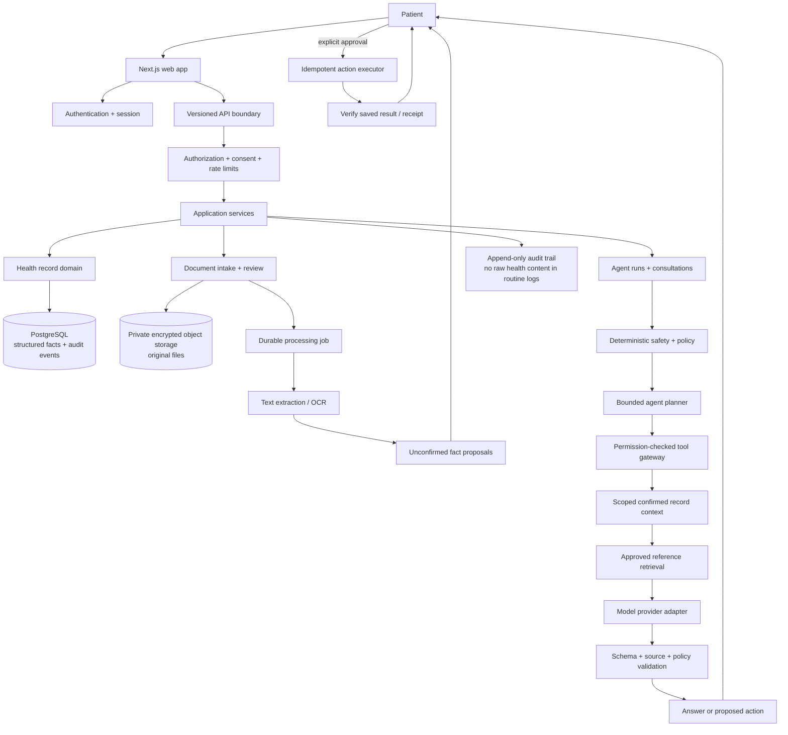

# NutritiScan web product system design

Status: proposed design for review. No new product architecture in this document is implemented by writing this file.

Updated: 5 October 2026

## 1. Product decision

**NutritiScan is an agentic AI health agent for a person managing their health.** Its job is to help the person understand relevant health information, organize their medical history, prepare for care, and follow through on user-approved next steps. Health history is the agent's trusted context and memory; it is a core platform capability, not the whole product. The agent should make progress on a task, show what it used, ask before important writes or sharing, verify completed actions, and hand off when a task exceeds its safe scope.

It is not an autonomous doctor. It must not independently diagnose, prescribe, change treatment, or make a clinical decision. The initial user is an adult patient acting for themself. Hospital-team workflows remain a possible later extension, once the patient-facing agent and a real workflow need are validated. Before any real-data pilot, validate the agent's first job with users and decide the launch geography, data-processing arrangement, and model provider policy.

### Agent behavior

Every agent task follows this loop:

**Understand → check safety and scope → plan → read permitted tools → draft → validate → request approval when needed → execute → verify → explain or hand off.**

The agent may autonomously read and organize information the person authorized it to use, retrieve approved educational sources, ask clarifying questions, and prepare drafts. It must get explicit approval before saving a new health fact, creating a persistent reminder or care task, exporting/sharing information, or contacting another person. Clinical decisions stay with the person and their qualified care team.

### Recommended first agent job: prepare for a care conversation

Start with **appointment preparation from a patient-selected set of health records**. It naturally proves the core loop—memory, scoped retrieval, planning, clarification, source-grounded drafting, approval, and a verified export—without pretending the agent can make a clinical decision. Report explanation and follow-up organization become the next skills after this journey works. Validate the choice in user interviews before real health data is involved.

### First complete user journey

1. A person asks for help with a health question or starts from a report, symptom, or upcoming appointment.
2. The agent checks for urgent signals and states its scope. For an urgent signal it stops ordinary planning and provides configured escalation guidance.
3. It reads only relevant, confirmed history the person has allowed it to use. It asks about important missing information instead of filling gaps from inference.
4. It prepares a source-linked answer or plan: facts to understand, questions to ask, and any follow-up the person requested. It separates record facts from the person's current report and from general information.
5. It shows the answer, plan, sources, and proposed actions. The person edits, confirms, or rejects each persistent action.
6. After approval, the server saves the brief/task, verifies the saved result, and shows what changed. External sharing is a separate action with a separate recipient and consent check.

Document intake, lab explanation, symptom organization and follow-up tasks are agent skills using the same trust boundaries. The first release should prove one complete task before broadening the skill set.

**First release success measure:** the share of supported agent journeys that end in a user-verified outcome (a source-grounded answer, approved brief, or confirmed task), with no unsupported fact or duplicate action. Track time to outcome, user corrections, extraction omissions, unanswered requests, approval/rejection rates, tool failures, and safe escalations. These are product measures, not evidence of improved health outcomes.

## 2. What exists and what does not

### Exists in the active web app

- `/` is the product landing page; `/chat` is an educational supervisor/specialist chat.
- `/api/chat` has request limits, deterministic safety triage, specialist routing, and answer validation for supported clinical turns.
- Chat threads, profile, and meal notes are browser-local. The submitted message and relevant context go to the configured model provider when hosted inference is enabled.
- `/discharge-demo` is a fictional, browser-local workflow demonstration. It is not a patient-record service.

### Does not exist in the active web app

- A signed-in patient account and server-authoritative medical history.
- A production health-document upload, extraction-review and confirmed-history journey.
- Durable consent records, account export/deletion, or a secure sharing workflow for this active app.
- A clinical validation study, live provider/ABDM/EHR connection, clinician network, or automated follow-up service.

Some older documents describe a removed account workspace or a hospital-first target. This document is the proposed product design; `docs/WEB_PRODUCT_REVIEW.md` records the current implementation gaps. Historical designs are not proof that a feature is live.

## 3. System boundaries

Use a **modular monolith** for the first release. Keep the Next.js web app and API in one deployable application, organize code into explicit domains, and add one background worker only when document processing needs durable retries. Do not begin with microservices, an agent framework migration, or a separate vector database.

### Logical modules

| Module | Responsibility | Must not do |
| --- | --- | --- |
| Web experience | Timeline, document review, chat, visit-brief editor, privacy controls | Treat browser state as canonical medical history |
| Identity and access | Sign-in, account recovery, session, access decisions | Trust a patient or role ID supplied in request JSON |
| Record service | Store confirmed facts, provenance, corrections, timeline | Accept model output as a confirmed fact |
| Document service | Private upload, malware/type/size checks, extraction job, review queue | Expose original files publicly or auto-commit OCR output |
| Agent runtime | Understand request, build a bounded plan, call scoped tools, draft typed output, resume/stop runs | Diagnose, prescribe, invent tool permissions, or treat its plan as an approved action |
| Tool gateway and action executor | Authorize every read/write; require approval, idempotency, expiry and verification for writes | Let the model call arbitrary SQL, URLs, or external actions directly |
| Safety service | Triage rules, policy checks, output validation, fixed escalation responses | Depend only on prompts or model self-assessment |
| Audit and operations | Record actor/action/resource/result metadata; latency and failure metrics | Put prompt text, report contents, or secrets in standard logs |

## 4. Request flows

### 4.1 Import and confirm a document

`browser → authenticated upload API → ownership and consent check → private object store → durable job → text/OCR extraction → structured candidate facts with source coordinates → review UI → explicit person confirmation → record service transaction → audit event`

Extraction is asynchronous: the UI can show `uploaded`, `processing`, `needs_review`, `completed`, or `failed`. Retryable infrastructure errors retry with an idempotency key; bad or unsupported documents become a visible failure. Every extracted fact retains document ID, page or field location, extraction version, and review status. A correction appends a replacement fact and keeps the old value in the audit history.

### 4.2 Run an agent task

`browser sends task + conversation ID → API authenticates owner → deterministic urgent-risk triage → policy fixes allowed scope and tools → planner proposes a typed plan → policy checks every tool call → server executes permitted reads → evidence and record context go to the model → model returns a typed answer/action proposal → server validates sources, scope and policy → UI shows plan, answer and proposed actions → person approves/rejects gated actions → executor rechecks policy and runs idempotently → server verifies persisted state/receipt → UI and audit trail show outcome`

The server owns canonical record context and tool execution. The client cannot grant the model more permissions or supply trusted facts. For clinical turns, the server buffers the draft until validation completes; it does not stream unvalidated medical claims. If the model, retrieval or validator is unavailable, the UI says which capability is unavailable and offers a safe next step. Every run has bounded steps, tools, retries, tokens, and wall-clock time.

### 4.3 Tool/action risk gates

| Risk tier | Example | Default behavior |
| --- | --- | --- |
| Read | Read a selected report or confirmed medication list | Execute after owner and scope checks; show sources used |
| Draft | Prepare an answer, visit brief, or question list | Return a reviewable draft; do not silently save it as a medical fact |
| Personal write | Save a fact, reminder, or care task | Show the exact change and require approval; use an idempotency key and verify the saved result |
| External action | Export to a recipient or send a message | Disabled in the first release; later require recipient, payload, consent and final confirmation, then show the receipt/failure |
| Clinical decision | Diagnose, prescribe, alter medication, or make a care decision | Never delegated to the agent |

### 4.4 Export or share a visit brief

`person opens draft → checks each fact/source → edits language → explicitly exports/downloads or chooses a recipient/channel → server checks session, scope and consent again → records the action → returns delivery/export receipt`

The first release should support a user-controlled download. Sending to a clinic, doctor, messaging service, or hospital is a later integration and needs a distinct approval step and delivery state.

## 5. Data model and trust rules

Start with relational PostgreSQL for identity links, structured records, job state, and audit events. Store originals as private encrypted objects and only keep object references and metadata in PostgreSQL. Add semantic/vector retrieval only when measured retrieval quality requires it; vectors never become the source of truth.

Initial logical entities:

- `accounts` and `patients`: separate login/PII from the opaque patient record ID.
- `documents`: owner, encrypted object key, content hash, MIME type, size, source, status, retention and timestamps.
- `health_facts`: patient, type, verbatim value, normalized value/unit when safe, effective date, source type, certainty, document/page pointer, confirmation and supersession fields.
- `fact_conflicts`: two incompatible source facts and their review state; do not choose a winner silently.
- `consultations` and `messages`: explicit retention choice, scoped memory, model/prompt version and request state.
- `agent_runs`: goal, status, bounded plan, policy/model/prompt version, permitted tools, step count, safe error category, timestamps and outcome.
- `action_proposals`: run ID, typed action and arguments, affected records, risk tier, approval status/actor/time, idempotency key, execution result and verification receipt.
- `brief_drafts`: permitted fact/source references, model output schema, citations, validator result, edits and final approval state.
- `care_tasks`: user-confirmed task/reminder, due time, status, source and provenance; notification configuration is separate and opt-in.
- `consent_grants`: purpose, source, data categories, time range, policy version, expiry and revocation.
- `audit_events`: actor, action, resource, time and outcome; exclude raw health values and conversation body.
- `processing_jobs`: idempotency key, job state, attempt count, retry time and safe error category.

Required invariants:

1. Each health fact carries provenance; a fact without a source is not a confirmed fact.
2. `patient_reported`, `document_extracted`, `device_measured`, and `clinician_verified` remain distinct. `model_inferred` is a proposal, never a source fact.
3. Corrections append a new value and preserve what was previously known.
4. Dates, original units, normalized units, lab-provided ranges and unknown values remain explicit.
5. The account/session determines the patient scope. Every read, write, export, and delete checks ownership server-side.
6. Data sent to a hosted model follows a visible, provider-specific policy. Real health data stays disabled until the processing terms, region and operational controls are reviewed.
7. Export and deletion cover database rows, file objects, search indexes, caches and documented backup-retention behavior.

Do not ship real patient records until authentication, isolation, consent, retention, provider handling, security review and an incident process are designed and tested for the chosen launch region.

## 6. API shape

Use `/api/v1` for new resource APIs. The browser sends a message or an upload; the server derives account and patient IDs from the authenticated session.

| Endpoint | Purpose |
| --- | --- |
| `POST /api/v1/documents` | Upload one allowed document; return a processing ID |
| `GET /api/v1/documents/{id}` | Get processing status and proposed facts for the owner |
| `POST /api/v1/documents/{id}/confirm` | Confirm or correct proposed facts; create provenance-backed record entries |
| `GET /api/v1/patient/timeline` | Paginated, source-linked confirmed history |
| `POST /api/v1/consultations` | Create a conversation with a declared data scope |
| `POST /api/v1/consultations/{id}/messages` | Create a validated answer/draft; streaming only for safe, nonclinical status updates |
| `GET /api/v1/agent-runs/{id}` | Read the owner's agent run, progress, approvals needed and result |
| `POST /api/v1/agent-runs/{id}/actions/{actionId}/approve` | Approve one exact proposed action; server rechecks identity and policy |
| `POST /api/v1/agent-runs/{id}/cancel` | Cancel a queued/running task and prevent stale proposals from executing |
| `POST /api/v1/consultations/{id}/visit-brief` | Generate a draft from an explicit date range and selected sources |
| `GET /api/v1/care-tasks` | List confirmed user-owned follow-up tasks and their status |
| `POST /api/v1/visit-briefs/{id}/approve` | Record the person's reviewed final brief |
| `GET /api/v1/patient/export` | Download the person's portable data export |
| `DELETE /api/v1/patient` | Start and verify account/data deletion, with honest backup-retention status |

Every resource ID lookup must include ownership in the database query. A random UUID is not authorization. Validate request bodies with runtime schemas; return stable error codes and safe messages rather than provider exceptions.

## 7. AI and agent design

Start with one user-facing agent and bounded task skills, not a free-roaming autonomous agent. Internal skills may handle records, report explanation, visit preparation, or follow-up. Begin with deterministic skill routing and one model call; separate specialist agents only when evaluation demonstrates a benefit:

1. Deterministic code checks urgent signals and whether the requested task is supported.
2. A router chooses a bounded skill and allowed tool set. Unsupported requests stop with an honest boundary.
3. A planner returns a versioned plan with goal, steps, read scopes, proposed writes, and stop conditions. Policy code may reject or narrow the plan before any tool runs.
4. Server-side tools read only permission-scoped facts and approved references. The model cannot issue arbitrary SQL, fetch arbitrary URLs, or call an unreviewed external tool.
5. The model returns a versioned result: answer, missing information, fact IDs, source IDs, proposed actions, and a confidence category with a reason.
6. Deterministic validators check that IDs are in scope, source claims match stored facts, citations exist, and forbidden advice/actions are absent.
7. The person approves gated actions. The executor rechecks policy, executes once, verifies persisted state/receipt, and ends the run as succeeded, needs approval, needs human, failed, cancelled, or expired.

Use one model call first. Add a second critic or specialist only if evaluations show a specific failure the extra latency/cost improves. Keep the provider behind an adapter so a hosted API can be disabled in favor of a local or approved model without moving domain rules into the prompt. Persist enough run metadata to explain what the agent tried, without retaining raw sensitive content in operational logs.

### Run and action lifecycle

An `agent_run` has one owner, goal, allowed record scope, allowed tool set, policy version, step limit, time limit, and stop conditions. Its states are `queued → running → needs_input | needs_approval | needs_human | succeeded | failed | cancelled | expired`. Each proposed write has its own state: `pending → approved | rejected | expired → executing → succeeded | failed`. Store state transitions as events so a worker restart resumes safely and a reviewer can reconstruct what happened.

Long-running follow-up is a scheduled task, not an always-on model loop. The person creates it or approves the agent's proposal; the scheduler wakes a bounded run at the due time, rechecks ownership/consent/policy, and asks the person for an update. A notification should avoid exposing sensitive health content on a locked screen. Never treat silence as completion or let a reminder infer a clinical outcome.

## 8. Failure handling and evaluation

| Failure | User-visible behavior | System behavior |
| --- | --- | --- |
| Unsupported/corrupt file | Explain accepted formats and offer manual entry | Do not create facts |
| Low-confidence/ambiguous extraction | Show the source and request correction | Keep facts unconfirmed |
| Conflicting dates, values or ranges | Show both sources and ask the person to resolve or leave unresolved | Preserve both facts |
| Model timeout/provider refusal | State that AI drafting is unavailable; keep records accessible | Safe error code, bounded retry, no silent substitute answer |
| Evidence retrieval empty | Say which answer could not be source-checked | Do not fabricate citations |
| Safety triage urgent | Show reviewed, region-configured urgent-care guidance | Halt ordinary generation; record rule ID without logging message text |
| Unauthorized record lookup | Show not found/forbidden safely | Deny and audit; do not confirm another account's data exists |
| Worker restart/retry | Keep processing state and display last safe status | Idempotent retry; no duplicate facts or external effects |
| Tool call outside plan/scope | Explain that the action is not available | Reject before execution; record policy rule and tool name, not sensitive arguments |
| Duplicate approval/retry | Show one final result | Idempotency key prevents duplicate task creation or sharing |
| Approval expires or person cancels | Show that no action ran and allow a fresh review | Mark proposal expired/cancelled; do not execute stale approvals |

Evaluation layers:

- Unit tests for parsing, provenance, access checks and state transitions.
- Synthetic document fixtures for extraction omissions, wrong units, duplicate files, conflicting values and mixed-patient pages.
- AI evaluations for correct source use, invented facts, unsafe certainty, unsupported recommendations, refusal behavior and prompt injection.
- Browser journeys for upload/review, timeline, visit brief approval, export/delete, narrow screen and keyboard access.
- Security tests for cross-account IDOR, revoked consent, stale session, rate limits, oversized uploads and audit leakage.
- Human review of health-specific acceptance criteria. Passing software tests is not medical validation.

## 9. Delivery sequence

### M0 — Product and data decisions

Validate the recommended appointment-preparation job with a few target users. Decide one launch geography, accepted first document type, explicit retention, and whether model processing is on-device or through a reviewed provider. Until decided, use synthetic records only.

### M1 — Synthetic agent vertical slice

Person asks for visit preparation → agent explains its plan → reads a fixed synthetic history through tools → asks for missing details → drafts a source-linked brief and optional reminder → person approves/rejects → action runs once → app verifies and shows the result. Include cancellation, timeout, retry, unsupported and urgent paths. No account sync, real uploads or external messages yet. This establishes the agent loop with safe data.

### M2 — Secure backend foundation

Authentication, migrations, owner-scoped record API, private object storage, audit events, export/delete path and cross-account tests. Keep model processing disabled for real data until its data boundary is reviewed.

### M3 — Real document import

Allowed PDF/text input, size/type checks, malware scanning, asynchronous extraction, review and correction, deduplication, retries and browser end-to-end coverage.

### M4 — Health agent skills

Scoped read tools, curated source retrieval, typed answers and visit briefs, deterministic validation, run/step trace UI, bounded follow-up tasks, AI evaluations, and explicit save/share confirmation. Add a skill only with an end-to-end evaluation set and defined failure behavior.

### M5 — Pilot readiness

Accessibility, failure drills, security review, data export/deletion rehearsal, provider and region review, support/incident ownership, and a consented pilot plan. Only then consider an approved live record connector or the hospital discharge workflow.

## 10. Deliberately postponed

- Hospital user roles, organization tenancy, discharge queues and lab-system polling.
- Automatic patient messaging, appointment booking, medication changes, diagnosis or treatment plans.
- Multi-agent debates, unbounded autonomous action loops, vector database and model fine-tuning.
- Broad EHR/ABDM integrations, voice agents, payments and clinician marketplace.

These are postponed to keep the first system understandable, testable and useful. They can be added when user evidence and the required operational approvals justify them.

## 11. Learning translations

- A Next.js route handler is like a **FastAPI endpoint**: it receives untrusted input, authenticates, validates, calls domain services, and returns a response.
- Zod schemas are like **Pydantic models**: they validate data at runtime; TypeScript types alone disappear when code runs.
- A database transaction is like making a set of Python updates atomically: either the fact plus audit event both save, or neither does.
- Provenance is a **receipt for each health fact**: it answers where the fact came from and who checked it.
- An agent tool is a narrow function the model may request. The app still checks access and confirms important writes, just as a backend service would for any user.
- An evaluation set is a repeatable exam for the AI. Unit tests check exact rules; AI evals check whether varied model answers stay within the product's boundaries.

## 12. Decisions still open for review

- Validate appointment preparation as the first agent job; change it only if user interviews reveal a more urgent, frequent job.
- Choose the first supported document (lab report, prescription, or discharge summary) based on that job and user interviews.
- Choose launch country/region and a model/data-processing policy before real records are used.
- Decide accountless synthetic demo versus sign-in for the first public release.
- Decide which personal writes (notes, reminders, care tasks) the person may approve in the first release. External sharing stays disabled until designed end to end.
