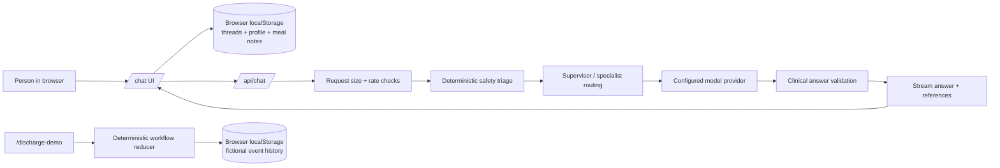

# NutritiScan web product review

Reviewed: 5 October 2026

This review describes the web application in this repository. It is a working prototype, not a production health agent. NutritiScan's target is a patient-facing agentic AI health agent; the current public `/chat` experience is an educational conversation and `/discharge-demo` is a fictional workflow simulator. See [the proposed product system design](PRODUCT_SYSTEM_DESIGN.md) for the target agent loop and architecture.

## What works today

- `/chat` provides a supervisor and specialist agents, streams answers, and includes source references, safety triage, and a clinician-facing consult note for supported clinical turns.
- Chat threads, profile details, and meal notes live in the current browser. A configured hosted model receives the submitted message and relevant context; review provider data terms before entering sensitive information.
- `/discharge-demo` walks through a pending-test case from source review through assignment, simulated result arrival, clinician review, an approved draft message, and a simulated delivery receipt. Its records are fictional and saved in browser storage.
- The domain logic and health-answer behavior have a meaningful automated test and evaluation suite. The UI test harness was failing under Node 26 because its global `localStorage` shadowed the jsdom browser storage; this review fixes that harness.

## Current architecture

In Python terms, `/api/chat/route.ts` is similar to a FastAPI route, Zod request parsing is similar to Pydantic validation, and `applyWorkflowEvent` is a pure domain function: it receives the old state plus one event and returns a new state or rejects an invalid transition. The hosted model proposes language; deterministic code owns the workflow transitions and safety gates.

## Gaps before this can be a real care-team product

| Priority | Gap | Why it matters | Next implementation step |
| --- | --- | --- | --- |
| P0 | No sign-in, verified identity, owner boundary, or server-side health record | Browser storage is tied to one device and is not a safe shared medical record. | Add authenticated patient accounts, owner-scoped storage, and server-side access checks before accepting real records. |
| P0 | No approved source-system integration or real document intake | The demo uses fixed fictional text and a rule-based extractor. | Keep synthetic fixtures; define an authorized import boundary and source provenance before implementing PDF/OCR ingestion. |
| P0 | Demo actors are selectable labels, not authenticated people | A role check in a local simulator demonstrates workflow rules but cannot enforce real permissions. | Bind every action to a verified identity and server-enforced role/assignment. |
| P1 | No durable server audit, job retries, or delivery receipt integration | Browser history can be cleared or edited; simulated delivery does not reach a patient. | Persist append-only workflow events and add idempotent integration jobs with explicit human approval. |
| P1 | The chat is turn-based; there is no general run/approval/execute/verify lifecycle for agent tasks | Multi-step tasks can appear successful before durable work is saved or verified. | Add a bounded run state machine and one synthetic read → propose → approve → execute → verify journey. |
| P1 | No real browser end-to-end test of the product in Safari/Chrome | Component tests prove UI logic but not real navigation, scrolling, responsive layout, or browser behavior. | Add a small browser smoke journey after the first server-backed slice. |

Do not enter real patient data into this prototype. A synthetic workflow proves software behavior only; it does not prove clinical safety, legal readiness, hospital access, or useful outcomes.

## Senior-engineer build order

1. **Make the synthetic case journey excellent.** Keep the reducer deterministic, show provenance beside every extracted fact, and test every allowed and rejected transition.
2. **Write the API contract.** Define case, document, fact, task, approval, and event schemas before connecting storage. In Python terms, these are the Pydantic models at the system boundary.
3. **Add server persistence for synthetic cases.** Use migrations, tenant-shaped data ownership, and append-only events. Keep real data disabled until identity and access controls exist.
4. **Add authentication and role authorization.** The server derives the actor and permissions from the session; the browser never gets to declare that it is a clinician.
5. **Add document intake and extraction provenance.** Store source/version/page/line, confidence, and `unknown`; require a person to confirm uncertain facts.
6. **Add the workflow worker.** Use idempotency keys, retries, delivery receipts, deadlines, and human escalation. Agent output must never close a clinical task by itself.
7. **Add the AI extraction/agent layer behind tools.** Constrain model outputs to schemas, validate them, preserve source references, and evaluate omissions and false positives against fixed cases.
8. **Run an authorized shadow pilot.** Measure review completion, missed handoffs, correction burden, and failure paths before enabling actions that contact people.

## Learning plan while we build

- **Web boundary:** React client component → Next.js route handler. Learn which code runs in the browser and which code must stay on the server.
- **Data contracts:** TypeScript types and Zod schemas → Python type hints and Pydantic models. Types help the editor; runtime schemas reject untrusted input.
- **Agent design:** deterministic router and tools → model calls. A model is a probabilistic helper; workflow state and authorization stay ordinary code.
- **Persistence:** browser storage → SQL tables and migrations. Learn ownership, transactions, indexes, and why clinical events need an audit trail.
- **Evaluation:** unit tests for rules, UI tests for interactions, browser tests for journeys, and AI evals for model behavior. Each catches a different class of failure.
- **Operations:** logs, latency, rate limits, retries, and provider failure handling. A product is complete only when failure is observable and recoverable.

## Work completed in this review

The UI test harness now supplies deterministic browser storage to jsdom under Node 26. This fixes the failing component tests without changing production storage behavior. The existing unused-variable lint warning in `scripts/workspace-migrate.mjs` remains unrelated to the web product flow.
